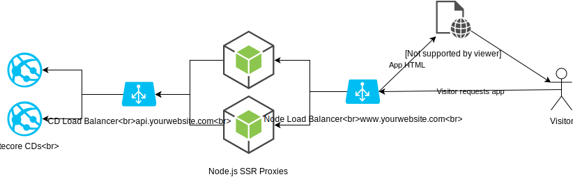
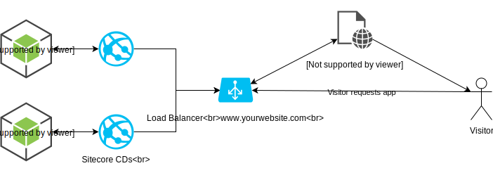

Sitecore JSS provides a lot of benefits in comparison to the &#8220;classic&#8221; Sitecore MVC/<del>Webforms</del> development approach in terms of both usage of the latest and greatest frontend frameworks, but also improving the development workflow. In this post I&#8217;ll describe steps and considerations of migrating an existing Sitecore solution to JSS, based on a real world project experience.

So, you&#8217;ve decided to migrate your Sitecore solution to JSS. On the high level, these are the steps you need to take:

  1. Choose frontend framework
  2. Choose development workflow
  3. Define code repository structure
  4. Refactor backend code
      1. Setup JSS application
      2. Refactor Sitecore templates
      3. Get rid of MVC Controllers, Razor views, ORM code
      4. Create JSS renderings
      5. Consider Helix architecture
      6. Update Sitecore Analytics code
  5. Implement frontend application (_can be done in parallel with the previous step_) 
  6. Define deployment topology
  7. Update build and deployment process

Let&#8217;s dig into each of them in details. 

## 1. Choose frontend framework


On the moment of writing, JSS supports 3 major frontend frameworks: Angular, React and Vue.JS. Discussion on which framework is better deserves a separate blog post or even a book, but it definitively depends on the concrete requirements. However, there are several things to consider:

  * Sitecore is not giving a preference to any of these 3 and will equally support all of them. 
  * However, Sitecore is developing their UIs on Angular (SPEAK 3, Horizon) which might push you towards investing into Angular knowledge in your company to kill two birds with one stone.

Personally, I don&#8217;t give a preference to any of them, however since historically in my current company frontend developers mostly work with Angular and the old project implementation used AngularJS 1.7, we&#8217;ve decided to go for Angular.

## 2. Choose a development workflow

Sitecore JSS suggests 2 development workflows: Code First and Sitecore first, which are well described in [JSS documentation](https://jss.sitecore.com/docs/fundamentals/dev-workflows/overview "JSS documentation").

However, in the refactoring existing Sitecore solution scenario, it is much more beneficial to use the Sitecore first approach:

  * Sitecore templates are already implemented, therefore you will be able to reuse them. This is a ready-made contract which you can use for your frontend components. 
  * Your solution is already split into components. There is no need to re-invent the wheel and do it again. 
  * It is quite easy to get used to the Sitecore first workflow, since this is how most of Sitecore companies are used to work.

I personally like to call Sitecore first workflow **Contract first**. Because what happens in reality is:

  1. Backend and frontend developers define a contract by agreeing on fields to be used in Sitecore template and on how the page would be split into components. To make the contract more material, both parties together can create mock data for frontend developers to be able to [work disconnected](https://jss.sitecore.com/docs/techniques/working-disconnected/disconnected-overview "work disconnected") (by skipping the manifest generation and Sitecore import of course. Idea here is just to be able to work independently).
  2. BE and FE developers can work in parallel based on the contract. Backend developers create templates and make sure JSS Layout Service output follows the contract and frontend developers create their implementation based on the mock data (which resembles the Layout Service output according to the contract).
  3. When both sides are done, component it tested in integration and all misalignment issues if any, are fixed.

Anyway, **Sitecore First** / **Contract First** is just naming, which is, as you know, the hardest thing in software development 😉

## 3. Choose repository structure


While thinking about repository structure for your Sitecore JSS project, you might consider keeping your code for a frontend app and a backend solution in separate code repositories. This gives a lot of freedom and separation, however keeping backend code and JSS application code in the same repository gives the following benefits:

  * Easier versioning of solution as a whole
  * Easier to revert cross-cutting changes, which involve both BE and FE code
  * Simpler to manage

This is also recommended approach according to the [JSS DevOps guide](https://jss.sitecore.com/docs/techniques/devops#deployment-best-practices " JSS DevOps guide").

If you follow the recommendation, **do** keep the code of your JSS frontend application in a separate folder, **do not** mix it with backend code. This allows to keep clear separation and isolation.

## 4. Refactor backend code


It is important to know that it is possible to keep both old Sitecore MVC/Webforms and new JSS implementations running in same solution side by side. This is very useful if you want to incrementally migrate your solution by spitting the process into parts by refactoring chunks of functionality. Also this approach can be useful when you want to start building new features on JSS, and refactor old features later on.

Below is the overview of what needs to be done to refactor backend code base.

### 4.1 Setup JSS application

At first you need to create a JSS app. There are two approaches you can take:

  * Create all the items manually using JSS Sitecore templates. 
  * Import a sample JSS app, as described [here](https://jss.sitecore.com/docs/getting-started/app-deployment) and then cleanup what&#8217;s not needed. 

I prefer and advice the first approach, as it is more clean and gives you full control:

**Create a JSS app item**

Create an item based on the **/sitecore/templates/Foundation/JavaScript Services/App** template, this will be the root of your JSS application (make sure you have done the [JSS Server Setup](https://jss.sitecore.com/docs/getting-started/jss-server-install "JSS Server Setup") first). If you want to run the JSS app side by side with your existing app, you can choose to create this item under the website start item, for example: /sitecore/content/MyClient/home/**vnext**, where **vnext** is the JSS app root. 

**Create a configuration file**

Setup a configuration file for your app. For this I advice to copy the config file from the Github Samples, e.g : [https://github.com/Sitecore/jss/blob/dev/samples/angular/sitecore/config/JssAngularWeb.config](https://github.com/Sitecore/jss/blob/dev/samples/angular/sitecore/config/JssAngularWeb.config), carefully review it and remove what&#8217;s not needed (e.g if you don&#8217;t plan to use GraphQL remove all the GraphQL parts). You will probably want to store this config file in the Project layer, meaning in the _App_config/Include/Project_ folder.

**Note:** _you can choose to define a separate Sitecore site for your JSS app, or use the same site which you have used for your old Sitecore MVC/Webforms site._

The key point of this configuration file the following, which defines the app itself:

```xml
<apps>
 <app name="MyJSSapp" 
      sitecorePath="/sitecore/content/MyClient/home/vnext" 
      inherits="defaults"/>
</apps>
```

Note that `sitecorePath` should point to your JSS app root. If you decide to use the same Sitecore site for your new JSS app, as in the example, your app will now be accessible by: https://youroldsite.com/vnext/...

### 4.2 Refactor Sitecore templates

In your new JSS application you can reuse your Sitecore **datasource templates, setting templates and folder templates** (following [Helix terminology](https://helix.sitecore.net/principles/templates/template-types.html "Helix terminology") here) from the old implementation. However, you might also want to review them and refactor a bit, since it is a perfect moment to do so.

You will **not** be able to fully reuse your **page templates** though, as they need to change a bit:

  * You will have to replace their presentation details by using JSS Layout and renderings.
  * They have to inherit from the **/sitecore/templates/Foundation/JavaScript Services/Route** template.

### 4.3 Get rid of MVC Controllers, Razor views, ORM code

Typical Sitecore MVC solution contains MVC Controllers, Razor views and likely some ORM (e.g GlassMapper) code. 

In a JSS website the above mentioned things are not relevant anymore, since JSS layout service will serialize Sitecore items directly into JSON without any intermediate code/mapping (unless you need some logic, which is discussed further). For example:


### 4.4 Create JSS renderings

Here is a brief process of refactoring a Sitecore MVC/Webforms rendering to a JSS rendering:

**Create a JSS rendering item**

  * Create an item based on the **/sitecore/templates/Foundation/JavaScript Services/Json** Rendering template.
  * [_Optional_] Fill in the Component Name field, in case it does not match the rendering item name for some reason.

**Choose a rendering contents resolver**

Depending on complexity of your component, you have several options on how to serialize it’s contents to JSON:

  * Use out of the box rendering contents resolver. Sitecore [ships with 5 of them included](https://doc.sitecore.com/xp/en/developers/hd/200/sitecore-headless-development/customizing-the-layout-service-rendering-output.html#choosing-or-configuring-a-built-in-rendering-contents-resolver "ships with 5 of them included"), which cover most of the basic scenarios: _Datasource Resolver, Datasource Item Children Resolver, Context Item Resolver, Context Item Children Resolver, Folder Filter Resolver_
  * If out of the box ones do not fit, you can [build your custom one](https://doc.sitecore.com/xp/en/developers/hd/200/sitecore-headless-development/customizing-the-layout-service-rendering-output.html#creating-an-irenderingcontentsresolver-interface "build your custom one"). For example, if your datasource is not a single item or children of an item, but a multilevel arbitrary tree hierarchy, e.g. multilevel menu, then you might want to roll your own one. I have blogged recently on [how to build a resolver which is able to serialize arbitrary item trees]( "how to build a resolver which is able to serialize arbitrary item trees").
  * There is also an option to shape the JSON response for your component via [integrated GraphQL](https://doc.sitecore.com/xp/en/developers/hd/200/sitecore-headless-development/integrated-graphql-in-jss-apps.html "Integrated GraphQL"). In a nutshell, there is a field on rendering item where you can define a GraphQL query which would retrieve all the needed data for your component and shape it to JSON. 
  * In certain scenarios you might want to combine the power of both rendering contents resolver and integrated GraphQL. You can achieve this with a [bit of customization]( "bit of customization").

**Provide extra data for renderings**

Sometimes you need to provide some extra data to your FE app, for example shared configuration or something which is relevant for all pages/components. In this case you have several options:

  * **Extend layout service context data**. This will make sure that each Layout Service response would have the data you need in the context object. More information can be found in [JSS documentation](https://doc.sitecore.com/xp/en/developers/hd/200/sitecore-headless-development/extending-context-data-returned-by-the-layout-service.html "JSS documentation").
  * **Use Integrated GraphQL.** As I&#8217;ve mentioned before you can combine different sources of data, e.g datasource item and some configuration items into a single GraphQL query.
  * And if you have some complex scenario, e.g reading some data from config files or databases, consider using a custom rendering contents resolver.

### 4.5 Consider Helix architecture

The topic of Helix and Sitecore JSS deserves a separate post on it&#8217;s own, which I coincidentally already have written already some time ago 😉 : [Sitecore JSS meets Helix]( "Sitecore JSS meets Helix").

### 4.6 Update Sitecore Analytics code

Your old Sitecore implementation might have had some Analytics code, e.g tracking events, goals. For this JSS comes with a [tracking service our of the box](https://doc.sitecore.com/xp/en/developers/hd/200/sitecore-headless-development/jss-tracking-api.html "tracking service our of the box").

This covers most of the basic scenarios. If you have to do something extra, e.g identify a contact, you have to build your custom API for that.

## 5. Implement frontend application

Even though this step comes after backend refactoring step, you can develop your frontend application in parallel with backend refactoring, just make sure that backend and frontend developers clearly define a data contract between each other to avoid surprises in the end.

I must say JSS team did really good job in providing [examples on Github](https://github.com/Sitecore/jss/tree/dev/samples "examples on Github") for each of the supported client frameworks. Not to mention, JSS code itself is opensource and they gladly accept pull requests.

Here are some tips for FE app implementation:

  * Unlike most of the Sitecore MVC/Webforms implementations, JSS apps are Single Page Applications. Obviously, this brings some changes in UX behavior of your website (no page reloads, etc) and you might want to consider implementing things differently than in old implementation. **This is very important to consider and to consult with your UX team upfront.**
  * I strongly recommend you not to enforce Helix in your fronted app and give your frontend developers freedom to use their own best practices, tooling and structure. More thoughts on this topic can be found here: [Sitecore JSS meets Helix]( "Sitecore JSS meets Helix")
  * Make sure to use helpers provided by JSS framework when rendering Sitecore item field values to make sure the fields are editable in Experience Editor. It is important for FE developers to get used to this, preferably in the beginning of a project to avoid refactoring in future.
  * Make sure to check the **Client Frameworks** section on the JSS documentation sites for your chosen framework. For example, it provides some [tips and best practices for Angular](https://doc.sitecore.com/xp/en/developers/hd/190/sitecore-headless-development/tips-for-working-with-jss-for-angular.html "tips and best practices for Angular"), for instance on lazy loading components.
  * To avoid page reloads when clicking links, make sure to you are [converting Sitecore links into router links](https://kamsar.net/index.php/2018/09/Routing-Sitecore-links-with-JSS/ "converting Sitecore links into router links")
  * Test your components in Experience Editor as soon as possible, do not postpone this to the end of a project. The earlier you develop a habit to implement Experience Editor compatible components, the better.

## 6. Define deployment topology

Sitecore has been quite a scalable platform even before JSS times. However JSS pushes Sitecore scalability (of the Content Delivery part) to the next level. 

JSS documentation suggests 2 deployment topologies: headless topology and integrated topology. But this is definitely not the limit, you can also consider doing some cool stuff like this: [Sitecore & Netlify CDN integration](https://altola.co/labs/sitecore-netlify-integration "Sitecore & Netlify CDN integration").

In [Headless topology](https://doc.sitecore.com/xp/en/developers/hd/200/sitecore-headless-development/jss-topologies.html#headless-topology "Headless topology") your JSS frontend application code is hosted on separate from Sitecore Node.js instances:



Not only it scales better, but also opens new possibilities:

  * You can keep your Sitecore instance beside a proxy, and have Node.js talking to the proxy instead of Sitecore. This would hide Sitecore instance from the outside world, improving your security by reducing attack surface.
  * You can choose to cache some JSS layout service requests in Node.js / proxy side, avoiding calls to Sitecore, which can improve performance significantly. 

However, this topology requires extra effort (setting up Node.js deployment pipeline) and hardware. Therefore, as a good starting point you might go for the [Integrated topology](https://doc.sitecore.com/xp/en/developers/hd/200/sitecore-headless-development/jss-topologies.html#integrated-topology "Integrated topology").



In this topology your frontend application code is pre-rendered by Node.js installed on the same server, where your Sitecore instance is (Sitecore is calling Node.js process internally to render the app).

After determining the topology, you should do the following:

  * Install Node.js on your Content Management and Content Delivery servers. You need it on CM server for Experience Editor to work, since it is relying on server-side rendering.
  * Install JSS server package on your environments.
  * Update your build process to build your JSS application frontend code. This point deserves a separate section.

## 7. Update build and deployment process {#update-build-and-deployment-process}

JSS site is still a Sitecore site, which consists of Sitecore items and files. Deployment of Sitecore items for your JSS apps stays the same: use an item serialization tool of your choice (Unicorn, TDS) for that. 

Even though deployment of JSS app frontend code is not much different from deployment of frontend code for Sitecore MVC (build, minify/optimize, copy the resulting files to the website), there are some additional things to know. 

JSS app requires some configuration settings to operate:

  * [API key](https://doc.sitecore.com/xp/en/developers/hd/200/sitecore-headless-development/create-a-sitecore-api-key.html "API key"), which is needed for CORS configuration and impersonating requests with specific Sitecore user. You would normally have one API key per JSS app. 
  * Layout Sevice host URL, required for the FE application to know where to retrieve data from. 

**Layout Servce host URL** is obviously different for each of your environments, therefore your build process has to tokenize these settings for your deployment tool to be able to replace them per environment. **Note:** _if you are using Integrated topology, you can also choose to leave this setting blank &#8220;&#8221;. This will build an environment-agnostic app bundle, which will always use current host name for all API requests._ _**However, this technique is not compatible with Connected mode and with Connected GraphQL, which require absolute URL to be provided.**_

**The API key** case is slightly more complex. If you decided to go for Integrated deployment topology, your FE code will be hosted on the same URL as Sitecore CD instance. This means that CORS will not be relevant and you can use same API key &#8220;CORS Origins&#8221; settings for all environments, meaning no need to tokenize it during the build process.

However, if you&#8217;ve decided to go for the Headless topology, you will have to make sure that your API key has proper CORS origins configured per environment (especially in production 😉 ). Since API key configuration by default is stored in Sitecore items (not sure why /=), it is quite tricky to tokenize the value of the &#8220;CORS Origins&#8221; field and replace it per environment. Therefore, you would need to either:

  * Manually update API key configuration per environment. This is the simplest, but the most tedious approach. And we, developers, love automation, right?
  * Customize the Sitecore.Services.Core.Security.IApiKeyRepository (you can replace it in DI configuration) to retrieve API keys from, e.g file system instead. In this case you would be able to easily tokenize the values in your config file and replace it during the deployment process.

Now that you decided which configuration settings have to be tokenized, you have to update your build process with the following steps (these are [JSS CLI commands](https://doc.sitecore.com/xp/en/developers/hd/200/sitecore-headless-development/sitecore-javascript-rendering-sdk-cli-tools-api-reference.html "JSS CLI commands")):

1. Run the `jss setup` command.

`jss setup --nonInteractive --apiKey="#{ApiKey}" --layoutServiceHost="#{LayoutServiceHost}"`

This will create the &#8220;scjssconfig.json&#8221; file with tokenized #{LayoutServiceHost} and #{ApiKey} configuration settings. This file is only used during build process.

2. Run the `jss deploy files` command.

`jss deploy files --destination="path\to\your\website\build\output"`

This command will build the app and copy the resulting files to the specified **destination** path. In case of **Integrated** topology, this path should point to the website root of your Sitecore site build artifact. If you are using **Headless** topology, then you would probably want to create a separate package to be deployed over to your Node.js instances.


You can find some extra information on topic of creating environment agnostic JSS application packages [in this blog post.]( "in this blog post.")

## Results

First of all, congratulations if you&#8217;ve managed to reach so far, it is quite a long read! 

To motivate fellow developers to migrate their Sitecore solutions to JSS, here are some results which we&#8217;ve achieved after migrating our project:

  * Frontend developers are extremely happy using modern framework and being able to work disconnected with Sitecore.
  * We&#8217;ve enabled parallel BE and FE development flow, which increased total development speed on 30% (based on comparing our sprint velocity before and after JSS migration)